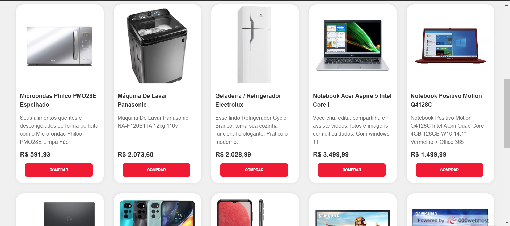
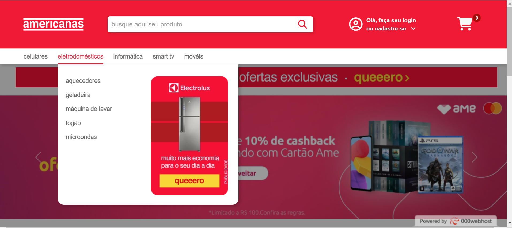
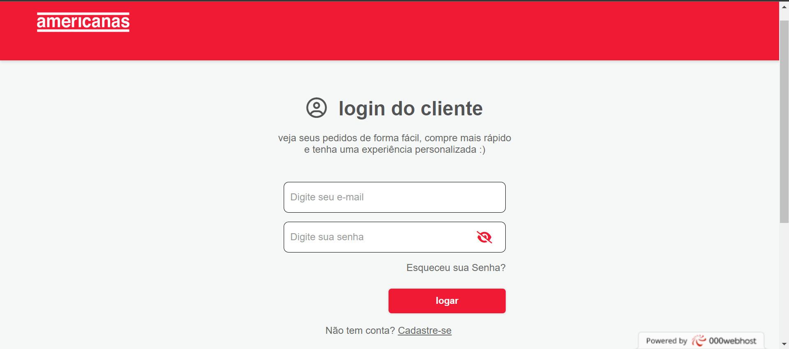

## AmericanasReplica

### Site realizado em PDO com algumas funcionalidades:

* Funçoes Genericas
* Pagina Notebooks
* Pagina de produto unico (Notebooks e index)
* Produtos recomendados, limitedrows
* Perguntas sobre produto, ajax. Não envia vazio e so aparece form para logados
* Ajax requisição assincrona de email (cadastro)
* Gif criado em css para loading de requisição email (cadastro, alterar senha)
* Email para troca de status
* Senha criptografada
* Ajax requisição assincrona de email(esqueceu senha, alterar senha)
* Alteração de senha por 'esqueci minha senha' (email)
* Alteração de senha com usuario logado (email)
* Cadastro e login com Google API
* Ajax pesquisa em tempo real /botão pesquisa normal
* Ajax para botões de compra
* Ajax para efeito de contador
* API para pegar Cep

### Algumas imagens de demonstração

